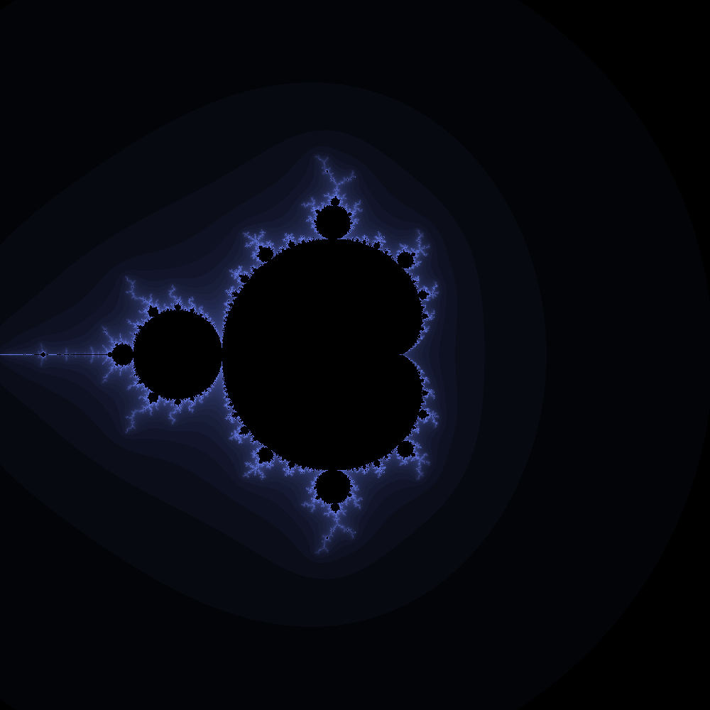

# Fractals

Thanks to [@SquiffyPwn](https://twitter.com/squiffypwn) I decided to create some fractals. Since I'm me I decided to make it a small fractal creation library / tool. So here is the result - a cpp library along with a cli tool which takes plugins to create custom fractals.

# Docs

Check out the cli tool source for an example use of the library. Basically you create a new `fractal` instance and then set the algorithm to use for generating the fractal and then you render it and create an image.

As for using the cli tool theres a bunch of flags that I will fully document in the binary one day (with a -h flag) but for now you can specify the resolution of the output image with `-w,-h` (width and height respectively), the escape parameter, the maximum number of iterations and the plugin to use for actually generating the fractal (yes if you want to use these parameters I am implying you need to look at the source. At this point of this project I require you to become familiar with the code yourself).

To create a fractal generator base it off of `mandlebrot.cc`. Simply compile it as a dylib and then specify it with the `-g` flag on the `fractalgen` utility.

# TODO

- Create proper docs
  - Modify above to be more in depth
  - Create manpage
  - Create `-h` flag
- Create makefile
- Streamline process to create gifs
- Add code to save as other formats
  - Add code to allow this to output a CoreGraphics bitmap
- Add alpha to saving components
- Add ability to have more complex color algorithms (like gradients etc.)
- Add node backend to communicate to this library
- Add website frontend
- Linux compatibility (maybe windows...)

# Some Notes

Note that as of right now this needs to be compiled with `c++11` so add the `-std=c++11` flag to your `CFLAGS`. This currently can only be compiled when you have libpng installed (note that you need to link to this lib to compile). This currently relies on libdispatch. I've heard it might be working on freebsd but I'm not sure, so just to be safe I would say it's only available on mac.

# Samples

Mandlebrot Set

